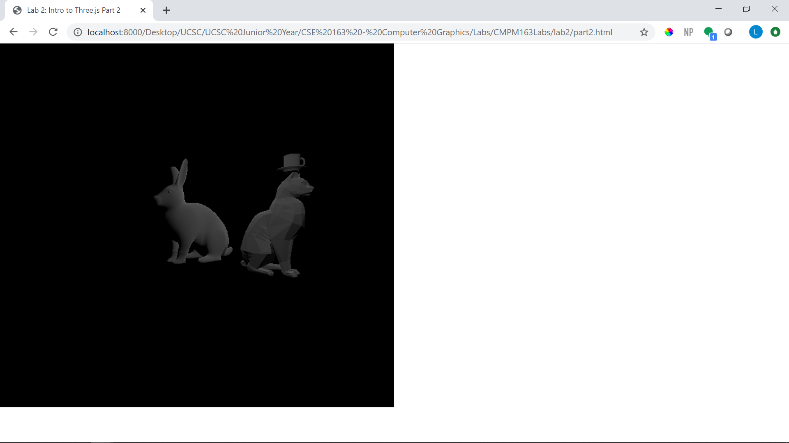

# CMPM163Labs
Labs for CMPM 163 Computer Graphics

Video: https://drive.google.com/open?id=1vSHDsyowr0fyHhjxGg9DJ0-n_ee-_6Vi

-------------------------------------------------------------------------------

Lab3

Video: https://drive.google.com/open?id=15LU04VW5fbpUmwzZfEzrOG7zBfPK1-rU

Far Left Cube: Used THREE.js to create material using MeshNormalMaterial and setting flatshading to true.

Middle Cube: Followed the instructions for Part2 about specular highlighting using the Phong model.

Top Cube: Created a new Fragment shader and changed the interpolation based on the y
 	 coordinate. Copied over AddCoolCube's code in a new method and played around
	 with Hex values to create an interesting color pallete.
	 
Right Cube: Followed the instructions in Part2 in order to create custom fragment and vertex shaders.

-------------------------------------------------------------------------------

Lab4

a. x = u * 7

b. y = v * 7

c. (.375, .25) = white

Video: https://drive.google.com/open?id=1cjkWZiBdLsYQRBpk_kvqRc3E8wHFQAx6

Middle Cube: Followed instructions from lab and implemented textures using three.js texture functionality.
	    Also utilized the normal map for dynamic lighting.

Left Cube: Basically created the same as the middle cube but without a normal map.

Right Cube: Created textures through loading custom shaders by following the directions.

Top Cube: The same as the right cube however, I utilized a different texture and made extra calculations
  	 in the fragment shader to map the uv in a tiled format. I solved this by using these equations:  
 	    if (u < .5) ? u = u * 2 : u = (u-.5) * 2;  
	    if (v < .5) ? v = v * 2 : v = (v-.5) * 2;  
	 by utilizing these equations I got the correct uv coordinates to send to gl_FragColor.

-------------------------------------------------------------------------------

Lab5

My modifications for this assignment inclues adding in particle systems by following the tutorial, changing
the color of the particles by using the unity interface, adding in new models that were in the asset folder
of the project but not used, and changing the material of the checkpoints by creating a new materical in the
unity interface and playing around with the settings. 